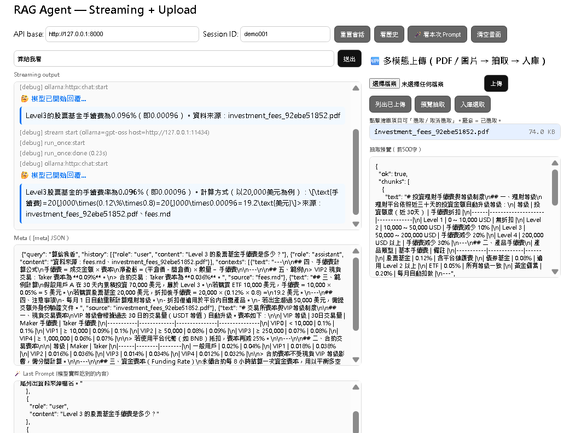
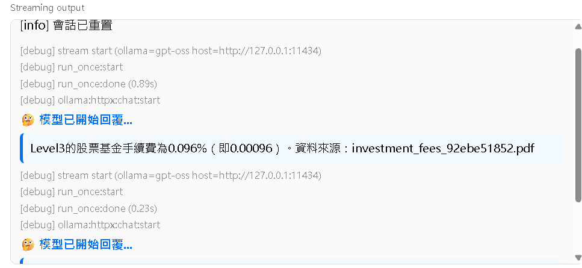
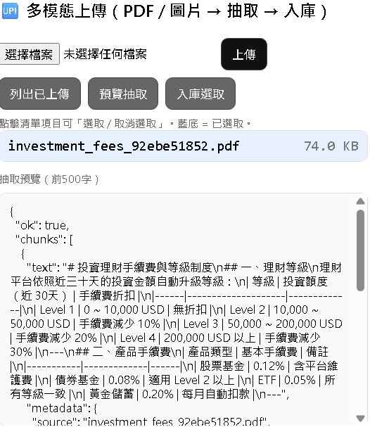
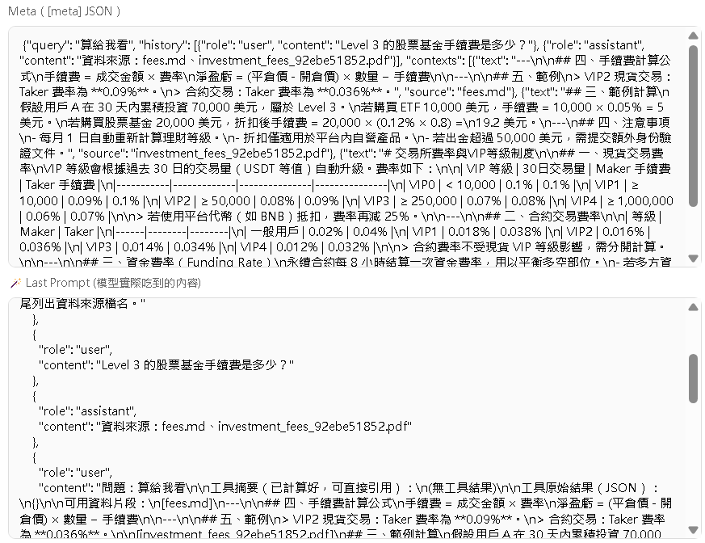

# 💬 Financial Agent — 智能多模態 RAG 助理

<p align="center">
  
</p>

> 🚀 一個整合 **RAG + LLM + Ollama + FastAPI + ChromaDB** 的智慧助理，  
> 支援 **多輪對話、PDF/圖片知識上傳、工具互通**，並可即時串流回覆。  
> 專為金融、交易所客服、法規文件助理等情境設計。

---

## 🧩 專案特色

| 功能模組 | 說明 |
|-----------|------|
| 💬 **多輪對話串流** | 即時 SSE（Server-Sent Events）串流輸出，類 ChatGPT 體驗 |
| 🧠 **RAG 檢索增強生成** | 對接 Chroma 向量資料庫，支援知識檔自動索引 |
| 📎 **多模態上傳** | 上傳 PDF / 圖片，自動 OCR / 文字抽取後入庫 |
| 🔍 **Prompt Debug 模式** | 可查詢模型實際輸入的完整 Prompt，方便調試 |
| 🧰 **工具互通架構** | 支援多個工具（如費率查詢、API Docs）互相傳遞資料 |
| 🌐 **Ollama 原生整合** | 直接串接本地 LLM（llama3、gpt-oss、mistral...） |
| 🧾 **Web 操作介面** | `web_test_stream.html` 可即時測試串流輸出與上傳功能 |
| 🗃️ **Session 持久化** | 使用 session_id 管理對話歷史，可隨時重置或查詢 |

---

## 🏗️ 系統架構

```mermaid
graph TD
    A[使用者 Web UI] -->|HTTP POST /stream| B[FastAPI Server]
    B --> C[run_once() 檢索流程]
    C --> D[ChromaDB 向量搜尋]
    C --> E[工具層 (如 VIP 手續費查詢)]
    B --> F[Ollama /api/chat or /api/generate]
    F --> G[本地 LLM 模型 (llama3.2:3b, gpt-oss...)]
    G -->|串流輸出| A
    A -->|上傳 /upload| H[PDF / 圖片抽取模組]
    H --> D
```

---

## 🖼️ 操作介面預覽

| 項目 | 截圖 |
|------|------|
| 📡 串流問答畫面 |  |
| 📎 上傳與入庫區塊 |  |
| 🧩 Prompt Debug 區 |  |

> 📷 以上圖片可放在 `docs/` 資料夾，命名如上（或自行替換實際截圖）。

---

## ⚙️ 安裝與執行

### 1️⃣ 建立虛擬環境並安裝依賴
```bash
conda create -n rag-agent python=3.10
conda activate rag-agent
pip install -r requirements.txt
```

### 2️⃣ 啟動 Ollama（本地模型）
```bash
ollama serve
ollama list
ollama pull llama3.2:3b
```

### 3️⃣ 啟動 FastAPI 主服務
```bash
uvicorn app.main:app --reload --host 127.0.0.1 --port 8000
```

### 4️⃣ 開啟測試網頁
```
web_test_stream.html
```

---

## 💡 使用說明

### 🗣️ 基本對話
1. 在輸入框輸入問題，例如：`VIP2 現貨 taker 手續費是多少？`
2. 觀察串流輸出（debug、thinking、模型回覆）
3. 回答結尾會附上資料來源（如 fees.md）

---

### 🧾 上傳新知識檔
1. 選擇檔案（支援 `.pdf`, `.png`, `.jpg`）
2. 按「上傳」→「預覽抽取」→「入庫」
3. 新資料會被自動索引並參與 RAG 查詢

---

### 🧠 查看模型實際 Prompt
點擊「🪄 看本次 Prompt」即可顯示這次發送給模型的完整指令。

---

## 🔍 API 一覽表

| Method | Path | 說明 |
|---------|------|------|
| POST | `/stream` | 串流問答（含多輪對話與 RAG） |
| POST | `/chat` | 非串流模式（整包 JSON 回傳） |
| POST | `/upload` | 上傳檔案（PDF / 圖片） |
| GET | `/files` | 列出已上傳檔案 |
| GET | `/diag/extract?name=` | 預覽檔案文字抽取結果 |
| POST | `/ingest/uploads` | 入庫檔案（建立向量索引） |
| GET | `/diag/last_prompt?session_id=` | 查看模型實際 prompt |
| POST | `/session/reset` | 重置會話 |

---

## 🧰 技術棧

| 類別 | 使用技術 |
|------|-----------|
| Backend | FastAPI, Python 3.10 |
| LLM Integration | Ollama REST API |
| Vector DB | ChromaDB |
| Frontend | HTML + JavaScript (SSE Streaming) |
| Extraction | PyMuPDF / pdfplumber / OCR |
| Deployment | Uvicorn, Conda |
| Debug Tools | Prompt Viewer / Session Inspector |

---

## 📁 專案結構

```
financial_agent/
├── app/
│   ├── main.py
│   ├── graph.py
│   ├── ingest.py
│   ├── tools/
│   └── index/
├── static/web_test_stream.html
├── docs/
│   ├── ui_stream.png
│   ├── ui_upload.png
│   ├── ui_prompt.png
│   └── cover_demo.png
├── requirements.txt
└── README.md
```

---

## 🧪 範例測試流程

```bash
# 基本 RAG 查詢
curl -X POST http://127.0.0.1:8000/chat -H "Content-Type: application/json" -d "{"q":"VIP2 現貨 taker 手續費是多少？"}"

# 上傳後查詢
curl -X POST http://127.0.0.1:8000/upload -F "file=@investment_fees_test.pdf"
curl -X POST http://127.0.0.1:8000/ingest/uploads -d "{"names": ["investment_fees_test.pdf"]}" -H "Content-Type: application/json"
curl -X POST http://127.0.0.1:8000/chat -H "Content-Type: application/json" -d "{"q":"Level3 股票基金手續費是多少？"}"
```

---
